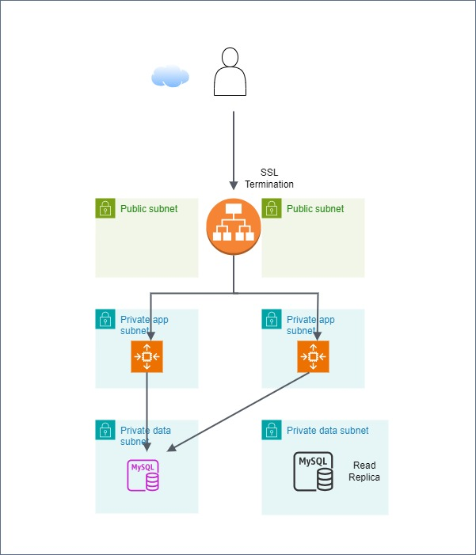

# alb-asg-database-tf
alb asg and database in terraform code

This repo builds modules to provision

-> vpc with two availability zones
-> nat gateways
-> acm
-> alb
-> ec2 asg
-> rds database 


# Prerequisites
Route 53 with a Valid public Domain

# Usage
  ````cd ssc-prod
  terraform init
  terrafom plan
  terraform apply
   ```
# Architecture Diagram
